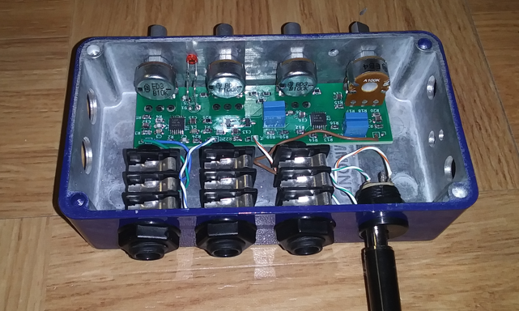

# Channel Two Preamp

Compact bass preamp for adding second input to an existing amplifier

## Here's the prototype

## If you just want to read about it

Here's the [main design article for version 1](https://raw.githubusercontent.com/bassistTech/ChannelTwoPreamp/main/Docs/Channel%20Two%20Preamp.pdf).

## Important Files

This repository is my *entire project folder* so there are a lot of extraneous files. I've listed the most important ones here.

.\Modeling\Channel Two model circuit v1.asc = LTSpice modeling circuit

.\Docs\Build journal - v1.pdf = Build notes for version 1

.\Docs\Channel Two Preamp.ipynb = Main documentation for the project

.\KiCad project\Channel Two v2\Channel Two v2 BOM.csv = Bill of materials

.\KiCad project\Channel Two v2\CAM20241109\CAM20241109a.zip = Gerber files for upload to PCB manufacturer
